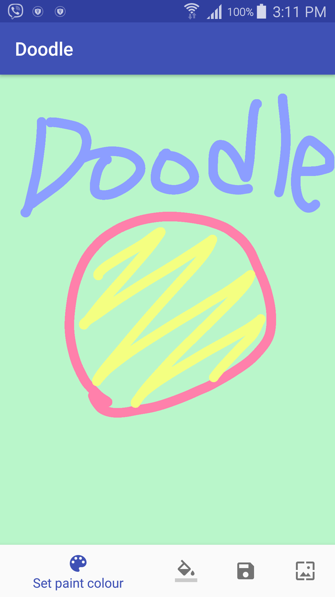
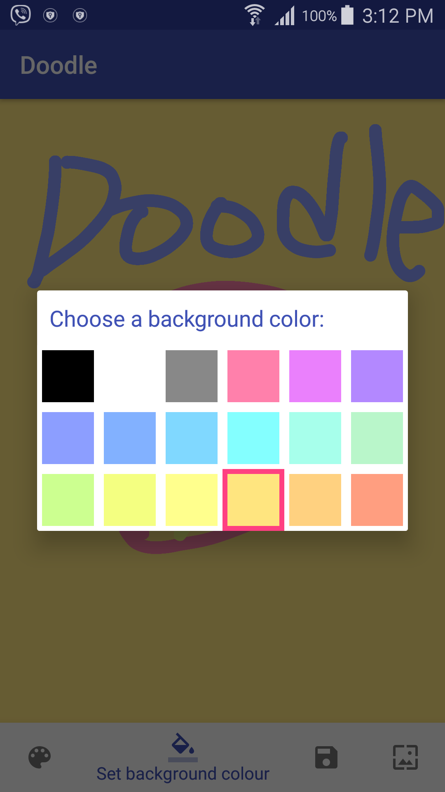

# Doodle
This app enables the user to draw a doodle using finger-touch with additional features.


## Introduction
This app allows the user to doodle on the screen with following features:
  - Enables the user to pick a doodle and a background colour
  - Saves a doodle in the gallery
  - Sets the doodle as a wallpaper
  - Sends the notification when the wallpaper has been sent

## Screeensthot
  

## Get started
To build this project, use the "gradlew build" command or use "Import Project" in Android Studio.
```sh
./gradlew build
```

## License
MIT
**Free Software!**